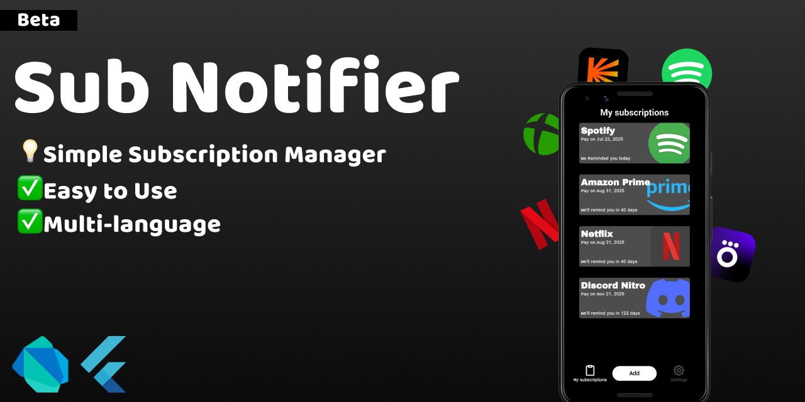

  

<h3 align="center">📋App that will help you to manage your Paid Subscriptions and Save Money</h3>

  <strong>⚠️ Warning:</strong> This is a test launch. Bugs and limited  app functionality are possible. 

<h1>✅Download (Only Android)</h2>

<h1>🚀Features</h1>
✨Open Source  
✨Supports Light and Dark Theme modes  
✨Ability to create hundreds of reminders  
✨Fast and Small App size  
✨Support Language change  
✨Modern and Comfortable Design  
<h1>🌐Avaible Languages</h1>
💂‍♂️English  
🥐French  
🐻Russian  

<h1>🤝Open For Contributing</h1>

We love contributions from the community!

<h2> *Out of ideas</h2>
